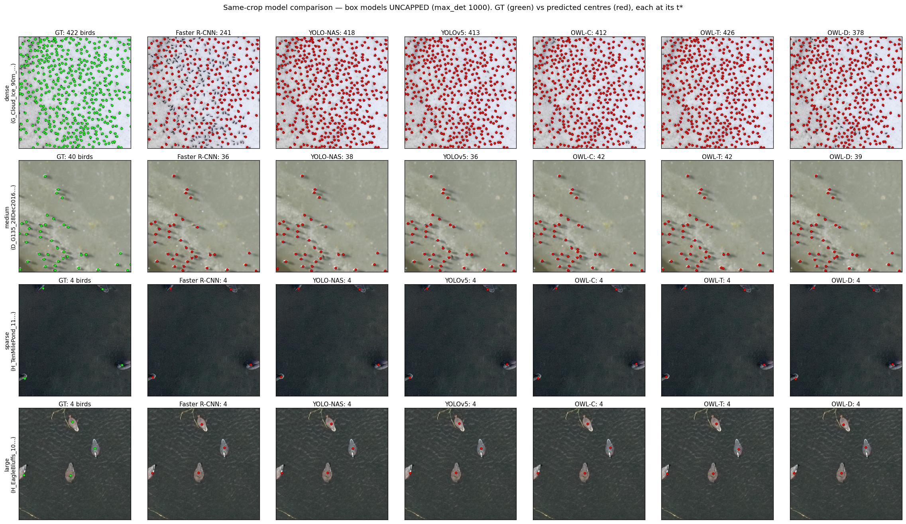

# Waterfowl Detection — Faster R-CNN, YOLO-NAS, YOLOv5, YOLO11, YOLO26 & MegaDetector-Overhead

Five model families share the same 512×512 COCO crops produced by `data_prep/`, so data
preparation only needs to be run once:

- **Faster R-CNN** (Detectron2) — `faster_rcnn/`
- **YOLO-NAS** (super-gradients) — `yolo_nas/`
- **YOLOv5** (Ultralytics) — `yolov5/`
- **YOLO11 / YOLO26** (Ultralytics) — `yolo_ultralytics/` — two generations via
  `--model`; YOLO26 is end-to-end (NMS-free)
- **MegaDetector-Overhead / OWL** (Microsoft AI for Good) — `megadetector_overhead/`
  — three variants via `--model`: **OWL-C** (DLA-34), **OWL-T** (DLA-34 + Swin),
  **OWL-D** (DINOv3 ViT-H+)

The first four are **box** detectors compared on a single protocol (mAP30, IoU = 0.30).
The Ultralytics models (YOLOv5, YOLO11, YOLO26) share one mirror of the crops in the
Ultralytics YOLO layout; MegaDetector-Overhead mirrors them into a point-CSV layout
(both built automatically from the same crops).

Head-to-head numbers for all eight models are in [Results](#results).

Each model is additionally scored as a **pretrained checkpoint before fine-tuning**, so
every result has a documented "before"
([`baseline/`](#zero-shot-baselines-before-fine-tuning)).

**MegaDetector-Overhead is different in kind** — it is a *point* detector (formerly "OWL",
Overhead Wildlife Locator): it localises each bird as a point, not a box. It therefore
cannot use the box-IoU mAP30 protocol directly, and it needs its own Python 3.11
environment (vendored DINOv3, incompatible with the detectron2/super-gradients/ultralytics
stack). It is scored two ways — a native point precision/recall/F1 and a bridging
"pseudo-box" mAP30 — and runs in a separate interpreter. See
[Running the Pipeline (MegaDetector-Overhead)](#running-the-pipeline-megadetector-overhead).

## Data

The raw aerial imagery (11 sub-datasets, `Bird_A`–`Bird_J`) is too large for git and
is hosted on the Hugging Face Hub:
**[juliamonson/waterfowl-uav](https://huggingface.co/datasets/juliamonson/waterfowl-uav)**.
Fetch it into `dataset/`, then `--prepare` regenerates the 512×512 crops and the COCO /
YOLO / OWL layouts from it (`crops/`, `yolov5_data/`, `mdo_data/` are all derived and
gitignored):

```bash
hf download juliamonson/waterfowl-uav --repo-type dataset --local-dir dataset/
```

Per-run **results** (metrics, configs, curves, example panels, logs) *are* committed
under `output/`; only model weights (`*.pth`/`*.pt`) are excluded. The trained **best
checkpoints** (plus a copy of the eval artifacts) are on the HF Hub:
**[juliamonson/waterfowl-uav-checkpoints](https://huggingface.co/juliamonson/waterfowl-uav-checkpoints)**.

### Dataset inventory and available metadata

[`dataset_full/DATASET_INVENTORY.md`](dataset_full/DATASET_INVENTORY.md) is a complete, measured
inventory of what metadata each of the ten sub-datasets actually carries — image, crop and
bird counts, annotation format, and per-dataset availability of species, sex, habitat,
altitude, date, site, camera and weather. Every value was read off the files; nothing is
inferred, and fields are recorded as unavailable rather than guessed.

The short version:

| | |
|---|---|
| Available everywhere | image/crop/bird counts, bounding boxes, **flight altitude** (100% coverage, 14–150 m), resolution |
| Available in part | species + sex (Bird_H, Bird_I — 7.4% of birds), habitat (G, H, J — 27% of images), weather (G, J), date + site (67% of images), camera + GPS (9% of images) |
| Not available at all | **decoy vs. real bird**, environmental conditions beyond sun/cloud, observer identity, bird behaviour |

It also determines which subgroup analyses the data can support: altitude is the only
covariate clean enough for a whole-corpus analysis, while habitat, species and weather are
confined to subsets and confounded with dataset identity.

> **Two loader bugs were found and fixed while compiling the inventory.** The loader
> guessed each image's label file by swapping the extension to `.txt`, which missed
> Bird_B and Bird_C — they name their label files differently — so 140 images and 3,138
> birds were skipped without an error. Separately, the annotation parser required every
> line to begin with a `bird,` label and silently discarded the shorter,
> coordinates-only lines used by 30 Bird_I images: those images entered the splits as **2,781
> background crops asserted to be empty**, while in fact holding 2,646 birds. Both are
> fixed, recovering 5,784 birds.
>
> **The committed results predate both fixes.** They were produced before Bird_B/Bird_C
> were readable and while those 30 images were labelled empty, so reproducing them exactly
> means not regenerating the splits.

### Are the splits fixed?

Yes — every model trains and evaluates on the same **75,664 / 24,374 / 25,708** crops,
and each run records those counts in its `run_info.json` so it can be checked after the
fact.

- **The test set is not random.** Every image arrives already marked as *training* or
  *testing* by the people who annotated it, in each dataset's `image_info.csv`. The
  pipeline honours that decision and never reshuffles it.
- **Train and validation are split 75/25** from the images marked for training, using a
  fixed random seed (42). It is reproducible because the pool of images is assembled in
  the same order every time: datasets are visited in sorted name order, and images within
  a dataset keep their original CSV row order.
- **One shared source.** Every package reads `output/crops_json/{train,val,test}/coco.json`;
  the Ultralytics and OWL mirrors are derived from those same files. Re-running
  `--prepare` regenerates identical splits rather than a new partition.

The seeded shuffle is only stable while the *input file set* is unchanged. Adding or
removing images under `dataset_full/`, or adding an entry to `EXCLUDED_DATASETS`
(currently empty), reorders the pool and reshuffles train/val membership for every
dataset — not only the one changed.

---

## Baseline v1 (frozen reference)

The eight-model benchmark is frozen and documented as **Waterfowl Detection Baseline v1**
in [`BASELINE_V1.md`](BASELINE_V1.md): splits, crop geometry, preprocessing, augmentation,
model versions, pretrained and fine-tuned checkpoints, training hyperparameters, inference
settings, thresholds, post-processing, the point-matching protocol, τ, the bootstrap
procedure, and the metric definitions — each read from the code that produced the results
rather than from intent.

It also records what the frozen baseline gets *wrong*, since those defects are part of the
reference: Bird_B and Bird_C are absent through a loader defect, and 30 Bird_I images enter
the splits as 2,781 crops asserted to be empty while holding 2,646 birds. And it lists the
[drift since the freeze](BASELINE_V1.md#16-drift-since-the-freeze) — the repository has
moved on, so re-running `--prepare` today will not reproduce v1. The committed
`output/crops_json/*/coco.json` files are the authoritative split.

## Results

Test split: **25,708 crops / 88,195 birds**, identical for every model (see
[Are the splits fixed?](#are-the-splits-fixed)). All numbers come from the committed
`output/checkpoints/<model>/<run>/eval_results.txt`.

Point metrics follow the OWL paper's protocol (τ = 40 px, B = 1,000 bootstrap); P/R/F1
are reported at each model's own optimal threshold t*.

| Model | mAP30 | point AP | P | R | F1 | MAE | RMSE | run |
|---|---|---|---|---|---|---|---|---|
| YOLO-NAS-m   | **77.46%** | **93.24%** | 90.79% | 88.12% | 89.44% | 0.500 | 1.746 | 2026-06-28 |
| YOLOv5m      | 76.79% | 92.59% | **92.59%** | 89.07% | **90.80%** | 0.434 | **1.593** | 2026-07-11 |
| YOLO11m      | 76.76% | 92.52% | 92.25% | **89.22%** | 90.71% | 0.436 | 1.635 | 2026-08-14 |
| YOLO26m      | 75.85% | 91.81% | 92.46% | 88.08% | 90.21% | 0.449 | 1.681 | 2026-08-15 |
| OWL-T        | 49.27%\* | 90.29% | 90.30% | 88.76% | 89.52% | 0.498 | 2.006 | 2026-07-24 |
| Faster R-CNN | 75.59% | 89.54% | 87.20% | 85.63% | 86.41% | 0.762 | 3.594 | 2026-06-27 |
| OWL-C        | 48.21%\* | 88.70% | 89.79% | 87.80% | 88.78% | 0.520 | 1.936 | 2026-07-21 |
| OWL-D        | 39.85%\* | 83.88% | 90.67% | 89.12% | 89.89% | **0.427** | 1.596 | 2026-07-26 |

\* OWL rows are the **pseudo-box** mAP30 bridge (points wrapped in 28 px boxes), not a
true box mAP — read it as an approximate cross-family comparison only. Rows are ordered by
point AP.

All models are scored at the same detection limit (`config.MAX_DETECTIONS_PER_IMAGE`,
500), which sits above the 422 birds in the densest crop so it cannot discard a real
detection from any model. For Faster R-CNN this governs both its post-NMS detection
budget *and* its RPN test-time proposal budget — the latter sits upstream and would
otherwise bound detections per crop on its own.

Read the two metric families separately — they disagree, and the disagreement is the
interesting part. The YOLO family takes the top four AP slots (91–93%), yet **OWL-D has
the best MAE** (0.427) while placing last on AP at 83.88%, and its recall (89.12%) is
second only to YOLO11. It localises birds as well as anything in the table and still
trails by nine AP points, because AP penalises how it *orders* its detections rather than
its ability to find them. Pick the metric that matches the question: AP for "did it find
this bird", MAE/RMSE for "how many were there".

Counting is close at the top: OWL-D's MAE 0.427 and YOLOv5's 0.434 sit within each
other's bootstrap intervals, and YOLOv5 edges RMSE (1.593 vs 1.596). Treat the leading
four as tied on counting rather than ranked.

Faster R-CNN sits mid-table on AP but is clearly weakest on counting, with an RMSE about
1.8× the next worst — a dense-crop weakness rather than a uniform one.

### Same-crop qualitative comparison



Four density regimes (422 / 40 / 4 / 4 birds) × six models on identical crops, ground
truth in green and predicted centres in red, each model at its own t*. The sparse and large-bird rows are saturated — every model
gets them exactly right — so the whole spread in the table above is decided by the dense
row: Faster R-CNN finds 241 of 422, OWL-D 378, and the other four land within ±2.5%
(OWL-T 426, YOLO-NAS 418, YOLOv5 413, OWL-C 412). Note this grid predates YOLO11/YOLO26,
which are not in it.

### Zero-shot baselines

- **Zero-shot (before fine-tuning).** The pretrained checkpoints scored on this same test
  split — see [Zero-Shot Baselines](#zero-shot-baselines-before-fine-tuning).

---

## Project Layout

```
rebuild/
├── dataset_full/               # Raw aerial-image datasets, 10 (read-only; not in git)
│   ├── DATASET_INVENTORY.md    # Measured metadata inventory (versioned; the data is not)
│   ├── Bird_A/
│   ├── Bird_B/
│   └── ...  (C, D, E, F, G, H, I, J)
│
├── data_prep/                  # Shared data utilities (reusable by future models)
│   ├── config.py               # All hyperparameters (anchors, RPN, LR, crop size…)
│   └── prepare_data.py         # Crops images → 512×512 patches + COCO JSON
│
├── faster_rcnn/                # Faster R-CNN model package (Detectron2)
│   ├── dataset.py              # Registers COCO splits with Detectron2
│   ├── model.py                # Builds Detectron2 CfgNode (ResNet-50 + FPN)
│   ├── evaluator.py            # Custom MAP30Evaluator (IoU threshold = 0.30)
│   ├── train.py                # WaterfowlTrainer + EarlyStoppingHook
│   └── main.py                 # Entry point for this model
│
├── yolo_nas/                   # YOLO-NAS model package (super-gradients)
│   ├── dataset.py              # super-gradients dataloaders from the same COCO crops
│   ├── model.py                # YOLO-NAS model, PPYoloELoss, mAP30 metric, train params
│   ├── train.py                # Trainer wrapper + per-run checkpoints
│   └── main.py                 # Entry point for this model
│
├── yolov5/                     # YOLOv5 model package (Ultralytics)
│   ├── dataset.py              # Mirrors the COCO crops → Ultralytics YOLO layout
│   ├── evaluate.py             # mAP30 via pycocotools COCOeval (IoU = 0.30)
│   ├── train.py                # Ultralytics YOLO.train() wrapper + per-run checkpoints
│   └── main.py                 # Entry point for this model
│
├── yolo_ultralytics/           # YOLO11 + YOLO26 package (Ultralytics), one entry point
│   ├── train.py                # Parameterised Ultralytics YOLO.train() wrapper
│   └── main.py                 # Entry point; --model {yolo11,yolo26}
│                               # (reuses yolov5/dataset.py + yolov5/evaluate.py)
│
├── megadetector_overhead/      # MegaDetector-Overhead / OWL package (point detector)
│   ├── dataset.py              # Mirrors the COCO crops → OWL point-CSV layout (box centres)
│   ├── train.py                # Generates a Hydra config + drives the OWL repo's trainer
│   ├── _eval_owl.py            # Runs UNDER the OWL .venv: point metric + detections
│   ├── evaluate.py             # Pseudo-box mAP30 via the same COCOeval (IoU = 0.30)
│   └── main.py                 # Entry point (shells into the OWL Python 3.11 env)
│
├── baseline/                   # Zero-shot scores of the PRETRAINED checkpoints, before
│   ├── detect.py               #   fine-tuning — one adapter per family → COCO results
│   └── main.py                 # Entry point: --model/--all/--summary/--save
│
├── third_party/                # Gitignored — cloned research repos
│   └── MegaDetector-Overhead/  # `git clone` + `uv sync` (.venv, vendored DINOv3, weights/)
│
├── crops/                      # Created automatically — crop images, organised by dataset
│   ├── Bird_A/
│   │   ├── A_DJI_0001_0_0.JPG
│   │   ├── A_DJI_0001_0_460.JPG
│   │   └── ...
│   ├── Bird_B/
│   └── ...  (one sub-folder per dataset)
│
├── yolov5_data/                # Created automatically — Ultralytics YOLO mirror of the crops
│   ├── data.yaml               # Dataset descriptor consumed by Ultralytics
│   ├── images/{train,val,test}/  # Symlinks back to crops/ (no images duplicated)
│   └── labels/{train,val,test}/  # YOLO txt labels (one "0 cx cy w h" line per box)
│
├── mdo_data/                   # Created automatically — OWL point-CSV mirror of the crops
│   └── {train,val,test}/
│       ├── images/             # Symlinks back to crops/ (flat; no images duplicated)
│       └── gt.csv              # Point labels: images,x,y,labels (box centre per bird)
│
└── output/                     # Created automatically — model artefacts only
    ├── crops_json/             # COCO annotation files (no images)
    │   ├── train/
    │   │   ├── coco.json               # Full training split (all datasets)
    │   │   └── coco_Bird_A_Bird_B.json # Filtered split (generated on demand)
    │   ├── val/
    │   │   ├── coco.json
    │   │   └── coco_Bird_A_Bird_B.json
    │   └── test/coco.json              # Test split is never filtered
    └── checkpoints/
        ├── fasterrcnn/                 # All Faster R-CNN runs live here
        │   └── 2026-06-23_14-36-59/   # One timestamped folder per training run
        │       ├── model_best.pth      # Best checkpoint (by val mAP30)
        │       ├── model_final.pth
        │       ├── metrics.json
        │       └── test_inference/     # Written by --eval
        ├── yolonas/                    # All YOLO-NAS runs live here
        │   └── 2026-06-28_10-30-00/   # One timestamped folder per training run
        │       └── RUN_<timestamp>/    # super-gradients nests checkpoints one level down
        │           ├── ckpt_best.pth   # Best checkpoint (by val mAP30)
        │           ├── ckpt_latest.pth
        │           └── average_model.pth
        ├── yolov5/                     # All YOLOv5 runs live here
        │   └── 2026-07-11_12-00-00/   # One timestamped folder per training run
        │       ├── weights/            # Ultralytics writes checkpoints here
        │       │   ├── best.pt         # Best checkpoint (by Ultralytics fitness)
        │       │   └── last.pt
        │       ├── run_info.json
        │       ├── results.csv         # Per-epoch Ultralytics metrics
        │       └── examples/           # Written by --eval
        ├── yolo11/, yolo26/            # Same layout as yolov5/ (yolo_ultralytics --model)
        └── mdo_owl_c/                  # MegaDetector-Overhead runs, one folder per model
            │                           # (mdo_owl_c / mdo_owl_t / mdo_owl_d — see --model)
            └── 2026-07-21_20-55-09/   # One timestamped folder per training run
                ├── weights/best.pth    # Best checkpoint (by val point-F1), stable handle
                ├── best_model.pth       # Raw checkpoint written by the OWL trainer
                ├── mdo_train_config.yaml # Generated Hydra config for this run
                ├── run_info.json
                └── eval/                # Written by --eval
                    ├── owl_eval.json    # Point metric + per-point detections
                    ├── metrics.json     # Point P/R/F1 + pseudo-box mAP30
                    └── ../examples/     # GT boxes | predicted points panels
    ├── baselines/<model>/<timestamp>/  # Zero-shot scores of the PRETRAINED checkpoints
    │                                   # (baseline/main.py) — same eval_results.txt layout
    └── baselines/summary.txt           # Zero-shot vs fine-tuned table (--save)
```

Every run directory also carries `eval_results.txt` (the human-readable metric blocks)
and `paper_point_metrics.json` (the OWL-paper protocol), which is what the
[Results](#results) tables above are built from.

Each dataset sub-folder contains:

- JPEG or PNG aerial images
- A `.txt` annotation file per image (`bird,x1,y1,x2,y2` per line)
- `image_info.csv` marking each image as `train` or `test` (the annotators' own split)

---

## Environment

The five **box** models (Faster R-CNN, YOLO-NAS, YOLOv5, YOLO11, YOLO26) and the
zero-shot `baseline/` pipeline all run in a single conda environment, `waterfowl`. MegaDetector-
Overhead runs in its **own** Python 3.11 environment (`third_party/MegaDetector-Overhead/.venv`,
created by `uv`) — its vendored DINOv3 + geospatial stack cannot coexist with
detectron2/super-gradients/ultralytics. See
[Running the Pipeline (MegaDetector-Overhead)](#running-the-pipeline-megadetector-overhead)
for its setup.

| Package         | Version           | Used by       |
| --------------- | ----------------- | ------------- |
| Python          | 3.10.20           | box models    |
| PyTorch         | 2.1.2 + CUDA 12.1 | box models    |
| Detectron2      | 0.6               | Faster R-CNN  |
| super-gradients | 3.7.1             | YOLO-NAS      |
| ultralytics     | 8.4.82            | YOLOv5, YOLO11, YOLO26 |
| pycocotools     | 2.0.11            | all (mAP30)   |
| Pillow          | 12.2.0            | box models    |
| opencv-python   | 4.11.0.86         | all           |
| _(separate env)_ PyTorch | 2.5.1 + CUDA 12.1 | MegaDetector-Overhead |
| _(separate env)_ Python  | 3.11              | MegaDetector-Overhead |

Create and populate it with:

```bash
conda create -n waterfowl python=3.10 -y
conda activate waterfowl
pip install torch --index-url https://download.pytorch.org/whl/cu121
pip install super-gradients ultralytics pycocotools pillow opencv-python
# Detectron2 (for Faster R-CNN) — see the official install matrix for your torch/CUDA:
#   https://detectron2.readthedocs.io/en/latest/tutorials/install.html
```

Notes:
- **YOLOv5 (Ultralytics)** auto-downloads its COCO-pretrained weights (`yolov5mu.pt`,
  etc.) from GitHub on first use — no manual download required.
- **YOLO-NAS (super-gradients)** pretrained weights are normally fetched from Deci's
  model hub, which is offline; place `yolo_nas_s_coco.pth` in
  `~/.cache/torch/hub/checkpoints/` (mirror: `https://d2gjn4b69gu75n.cloudfront.net/models/`)
  so the download is skipped.

---

## Running the Pipeline (Faster R-CNN)

All commands are run from the `rebuild/` directory.

### Step 1 — Prepare data (one-time)

Crops all datasets into 512×512 patches with 20% overlap (stride = 460 px) and writes
COCO-format JSON files for train / val / test splits.

```bash
./faster_rcnn/main.py --prepare
```

- Images are split **train / val / test ≈ 60 / 20 / 20**. The test set is the one the
  annotators marked in each dataset's `image_info.csv`; their training images are then
  divided 75 / 25 into train and validation.
- Only needs to be run once. The resulting COCO JSONs are reused by all training runs.

### Step 2 — Train

```bash
# Train on all datasets
./faster_rcnn/main.py --train

# Train on a subset of datasets by subfolder name
./faster_rcnn/main.py --train --datasets Bird_A Bird_B Bird_G
```

- **Backbone**: ResNet-50 + FPN, initialised from COCO-pretrained Faster R-CNN weights (`faster_rcnn_R_50_FPN_3x` from Detectron2 model zoo)
- **Anchor sizes**: 8, 16, 32, 64, 128 px
- **Epochs**: 100 (early stop if val mAP30 stalls for 30 consecutive evaluations)
- **Learning rate**: 0.001 (SGD + cosine decay)
- **Batch size**: 4
- Each run creates a new timestamped folder under `output/checkpoints/fasterrcnn/`
  (e.g. `2026-06-24_09-00-00/`). Previous runs are never overwritten.
- When `--datasets` is used, a filtered COCO JSON is written alongside the original
  (e.g. `coco_Bird_A_Bird_B_Bird_G.json`). The original `coco.json` is not modified.
  The test split is always the full set for a fair final evaluation.

### Step 3 — Evaluate on test set

```bash
# Evaluate the most recent training run
./faster_rcnn/main.py --eval

# Evaluate a specific run by its timestamp
./faster_rcnn/main.py --eval --run 2026-06-23_14-36-59
```

Loads `model_best.pth` from the selected run and reports **mAP30** (mean Average
Precision at IoU threshold = 0.30, matching the paper's metric).

### All steps in one command

```bash
./faster_rcnn/main.py --prepare --train --eval
```

---

## Running the Pipeline (YOLO-NAS)

The YOLO-NAS entry point follows the **same `--prepare / --train / --eval`**
interface and reuses the **same crops** as Faster R-CNN. If you already ran
`--prepare` for Faster R-CNN, skip straight to `--train`.

```bash
# Step 1 — prepare data (shared with Faster R-CNN; only needed once)
./yolo_nas/main.py --prepare

# Step 2 — train (saved to output/checkpoints/yolonas/<timestamp>/)
./yolo_nas/main.py --train

# Step 3 — evaluate best checkpoint on the test set
./yolo_nas/main.py --eval                       # latest run
./yolo_nas/main.py --eval --run 2026-06-28_10-30-00

# All-in-one
./yolo_nas/main.py --prepare --train --eval
```

- **Model**: YOLO-NAS (`yolo_nas_s` by default), initialised from COCO-pretrained weights
- **Epochs**: 100 (early stop if val mAP30 stalls for 30 consecutive epochs)
- **Learning rate**: 0.0005 (Adam + cosine decay), batch size 8
- **Evaluation**: mAP30 (IoU = 0.30), identical protocol to Faster R-CNN
- `--eval` also writes `N` side-by-side example panels (`--examples N`, default 40;
  left = ground truth, right = predictions). Each run gets its own timestamped folder
  under `output/checkpoints/yolonas/`.
- The variant and YOLO-NAS hyperparameters live in `data_prep/config.py`
  (`YOLONAS_MODEL`, `YOLONAS_BATCH_SIZE`, `YOLONAS_LR`, …).

---

## Running the Pipeline (YOLOv5)

The YOLOv5 entry point follows the **same `--prepare / --train / --eval`** interface
and reuses the **same crops** as the other models. Unlike Faster R-CNN / YOLO-NAS,
Ultralytics cannot read COCO JSON directly, so `--prepare` (and `--train`) also builds
a YOLO-format mirror of the crops under `yolov5_data/` (symlinked images + txt labels

+ `data.yaml`). This is automatic and idempotent — no images are duplicated.

```bash
# Step 1 — prepare data: shared COCO crops + Ultralytics YOLO mirror
./yolov5/main.py --prepare

# Step 2 — train (saved to output/checkpoints/yolov5/<timestamp>/)
./yolov5/main.py --train

# Step 3 — evaluate best checkpoint on the test set (mAP30)
./yolov5/main.py --eval                       # latest run
./yolov5/main.py --eval --run 2026-07-11_12-00-00

# All-in-one
./yolov5/main.py --prepare --train --eval
```

- **Model**: YOLOv5 (`yolov5mu` by default — Ultralytics' anchor-free YOLOv5u variant),
  initialised from COCO-pretrained weights that Ultralytics auto-downloads.
- **Epochs**: 100 (early stopping, patience 30)
- **Learning rate**: 0.0005 (Adam), batch size 8, image size 512
- **Evaluation**: mAP30 (IoU = 0.30) computed by `yolov5/evaluate.py` with pycocotools
  `COCOeval`, the **identical protocol** to Faster R-CNN and YOLO-NAS.
- `--eval` also writes `N` side-by-side example panels (`--examples N`, default 40;
  left = ground truth, right = predictions). Each run gets its own timestamped folder
  under `output/checkpoints/yolov5/`, with weights in `weights/best.pt`.
- The variant and YOLOv5 hyperparameters live in `data_prep/config.py`
  (`YOLOV5_MODEL`, `YOLOV5_BATCH_SIZE`, `YOLOV5_LR`, `YOLOV5_DATA_DIR`, …).

> **Two protocol caveats** specific to YOLOv5:
>
> 1. **Early stopping watches Ultralytics' internal fitness** (a blend of mAP@0.50 and
>    mAP@0.50:0.95), not mAP30 — Ultralytics does not expose a single-IoU monitor.
>    Only the **final** test report (`--eval`) is computed at mAP30. Faster R-CNN and
>    YOLO-NAS watch mAP30 directly during training.
> 2. **mAP30 uses pycocotools' default 100-detection-per-image cap.** Some crops hold
>    400+ birds, so this slightly understates recall on the densest scenes — but the
>    same cap applies to the Faster R-CNN evaluator, so the comparison stays fair.

---

## Running the Pipeline (YOLO11 / YOLO26)

Two newer Ultralytics generations, served by **one** entry point via `--model` (the same
pattern `megadetector_overhead/` uses for OWL-C/T/D). They read the **same
`yolov5_data/` mirror** YOLOv5 already builds, so `--prepare` is only needed once across
all Ultralytics models and no data is duplicated.

```bash
# Step 1 — only if you have never run any --prepare (shared with YOLOv5)
./yolo_ultralytics/main.py --prepare

# Step 2 — train (saved to output/checkpoints/yolo11|yolo26/<timestamp>/)
./yolo_ultralytics/main.py --model yolo11 --train
./yolo_ultralytics/main.py --model yolo26 --train

# Step 3 — evaluate best checkpoint on the test set (mAP30 + OWL point metrics)
./yolo_ultralytics/main.py --model yolo11 --eval
./yolo_ultralytics/main.py --model yolo26 --eval --run 2026-08-14_09-00-00

# All-in-one
./yolo_ultralytics/main.py --model yolo11 --prepare --train --eval
```

- **Models**: `yolo11m` (20.1M params) and `yolo26m` (21.9M params), COCO-pretrained and
  auto-downloaded by Ultralytics. Medium variants chosen to match YOLOv5m / YOLO-NAS-m.
- **Hyperparameters deliberately match YOLOv5**: 100 epochs (patience 30), Adam at
  0.0005, batch 8, image size 512 — so this is a like-for-like comparison across
  generations, not a per-model tuned bake-off. All in `data_prep/config.py` under
  `ULTRALYTICS_MODELS`.
- **Evaluation**: identical mAP30 (`yolov5/evaluate.py`, pycocotools `COCOeval` at
  IoU = 0.30) plus the shared OWL-paper point metrics, so results drop straight into the
  same tables as every other model. Both YOLOv5 protocol caveats above apply here too.

> **YOLO26 is end-to-end (NMS-free).** Its head reports `end2end=True`, so the NMS `iou`
> argument is accepted but has **no effect** — it is kept only for symmetry. `max_det`
> is held identical across all Ultralytics models, and is set above the densest crop in
> the split so it cannot discard a real detection from any generation.
>
> YOLO26 also ships a different default optimiser upstream. We override it to Adam to
> match the rest of the project — a fairness choice, not an oversight. If you want
> YOLO26 at its intended best rather than matched, change `optimizer` in
> `yolo_ultralytics/train.py`.

Naming: Ultralytics calls these **YOLO11** and **YOLO26** (no "v"); the OWL paper writes
"YOLOv11" for the same model. The paper benchmarks YOLOv11n and YOLOv11l — we use the
medium variant, so the paper's numbers are not directly comparable to ours.

---

## Running the Pipeline (MegaDetector-Overhead)

MegaDetector-Overhead / OWL is a **point** detector, so it does not fit the box-IoU
protocol the same way. Its entry point still follows the **same `--prepare / --train /
--eval`** interface and reuses the **same crops**, but it runs in a **separate Python
3.11 environment** and is scored two ways.

### One-time setup (separate environment + weights)

```bash
# 1. Clone the repo into third_party/ (gitignored)
mkdir -p third_party && cd third_party
git clone https://github.com/microsoft/MegaDetector-Overhead
cd MegaDetector-Overhead

# 2. Build its Python 3.11 GPU environment (installs torch 2.5.1+cu121, animaloc,
#    vendored DINOv3). Needs `uv` (curl -LsSf https://astral.sh/uv/install.sh | sh)
uv sync --no-default-groups --group gpu

# 3. Download the pretrained weights from Zenodo into weights/ — either per model via
#    the pipeline (recommended):
cd ../..
./megadetector_overhead/main.py --fetch-weights --model OWLC     # OWL-C.pth  (~216 MB)
./megadetector_overhead/main.py --fetch-weights --model OWLT     # OWL-T.pth  (~355 MB)
./megadetector_overhead/main.py --fetch-weights --model OWLD_H   # OWL-D.pth  (~3.5 GB)
#    or manually:
#    curl -L -o weights/OWL-C.pth "https://zenodo.org/records/20802844/files/OWL-C.pth?download=1"
```

Paths for all of the above live in `data_prep/config.py` (`MDO_REPO_DIR`, `MDO_PYTHON`,
`MDO_PRETRAINED`, `MDO_MODELS`). The main entry point runs under the `waterfowl` env like
the others and shells into `MDO_PYTHON` (`.venv/bin/python`) for training and inference.

### OWL model variants (`--model`)

Three OWL architectures are wired up. Each fine-tunes from its released overhead-benchmark
checkpoint (Zenodo [record 20802844](https://zenodo.org/records/20802844), **CC BY-NC-SA
4.0** — non-commercial) and writes to its **own** checkpoint folder, so runs never mix:

| `--model` | Architecture | Start checkpoint | Params (trainable) | Runs folder |
|---|---|---|---|---|
| `OWLC` *(default)* | HerdNet detection branch, DLA-34 | `OWL-C.pth` | 18M (18M) | `output/checkpoints/mdo_owl_c/` |
| `OWLT` | DLA-34 + Swin multiscale residual | `OWL-T.pth` | 30M (30M) | `output/checkpoints/mdo_owl_t/` |
| `OWLD_H` | DINOv3 ViT-H+/16 + DPT decoder | `OWL-D.pth` | 855M (15M) | `output/checkpoints/mdo_owl_d/` |

Notes:

- All three share the same data, losses, LMDS post-processing, and both evaluation metrics —
  only the network (and its start weights) differs.
- `OWLD_H`'s checkpoint bundles its **frozen** DINOv3 backbone, so it needs no separate
  (license-gated) Meta DINOv3 download; only the DPT decoder + head (~15M params) train.
  A training step at batch 8 peaks at ~8.3 GiB GPU memory, but the big backbone makes it
  markedly slower per epoch than OWL-C/T.
- The registry (`MDO_MODELS` in `data_prep/config.py`) defines each variant's constructor
  kwargs, start checkpoint, and folder; `megadetector_overhead/fetch_dinov3_weights.py`
  exists only for the advanced case of training an OWL-D variant from scratch.

### Run

```bash
# Step 1 — prepare: shared COCO crops + OWL point-CSV mirror (mdo_data/)
./megadetector_overhead/main.py --prepare

# Step 2 — fine-tune from pretrained weights (output/checkpoints/mdo_owl_{c,t,d}/<timestamp>/)
./megadetector_overhead/main.py --train                      # OWL-C (default)
./megadetector_overhead/main.py --train --model OWLT         # OWL-T
./megadetector_overhead/main.py --train --model OWLD_H       # OWL-D (ViT-H+)

# Step 3 — evaluate best checkpoint on the test set (point P/R/F1 + pseudo-box mAP30)
./megadetector_overhead/main.py --eval                       # latest OWL-C run
./megadetector_overhead/main.py --eval --model OWLT          # latest OWL-T run
./megadetector_overhead/main.py --eval --run 2026-07-21_20-55-09

# All-in-one
./megadetector_overhead/main.py --prepare --train --eval
```

- **Model**: selected with `--model` (see the variants table above; default `OWLC`),
  fine-tuned from its pretrained overhead-benchmark weights. Each box in the shared crops
  becomes one **point** at the box centre (`megadetector_overhead/dataset.py`).
- **Epochs**: 100 cap; the OWL trainer keeps the best checkpoint by **validation point-F1**
  and decays the LR on plateau (`auto_lr`) — this plays the role Faster R-CNN's
  early-stopping hook plays for the other models.
- **Learning rate**: 0.0005 (Adam), batch size 8, image size 512 — matched to YOLO-NAS/YOLOv5.
- **Two evaluation metrics** (`--eval` prints both and writes `eval/metrics.json`):
  1. **Point precision / recall / F1** — a prediction is a true positive when it lands
     within `MDO_POINT_RADIUS` of a ground-truth point (≈20 px full-res at `down_ratio` 2).
     This is the honest metric for a point model, computed by the OWL repo's own evaluator.
  2. **Pseudo-box mAP30** — each detected point is wrapped in an `MDO_PSEUDO_BOX`-px box and
     run through the **identical** `COCOeval`@IoU=0.30 as the other three, so OWL lands in
     the same table. Read it as an approximate bridge: a point has no real extent, so the
     absolute value depends on the (fixed) pseudo-box size.
- `--eval` also writes `N` example panels (`--examples N`, default 40; left = GT **boxes**,
  right = predicted **points**).
- OWL hyperparameters live in `data_prep/config.py` (`MDO_MODEL`, `MDO_MODELS`,
  `MDO_BATCH_SIZE`, `MDO_LR`, `MDO_POINT_RADIUS`, `MDO_PSEUDO_BOX`, `MDO_LMDS_*`, …).

> **Protocol caveats** specific to MegaDetector-Overhead:
>
> 1. **It is a point detector.** The point metric (1 above) is the faithful score; the
>    pseudo-box mAP30 (2) exists only to place it on the same axis as the box models and
>    is sensitive to `MDO_PSEUDO_BOX`. Don't read the two models' mAP30 as strictly
>    like-for-like.
> 2. **Separate environment.** Unlike the other three, its weights, deps, and interpreter
>    live under `third_party/MegaDetector-Overhead/` (all gitignored). The `waterfowl` env
>    is untouched.
> 3. **License.** The OWL pretrained weights are **CC-BY-NC-SA 4.0 (non-commercial)** —
>    stricter than the other models' weights; check before any commercial use.

---

## OWL-Paper Point Metrics (all models)

Every model's `--eval` additionally reports the evaluation protocol of the OWL paper
(Chacón et al., Section 4.3), implemented once in `data_prep/point_metrics.py` and
shared by every pipeline — Faster R-CNN, YOLO-NAS, YOLOv5, YOLO11, YOLO26 and the three
OWL variants — so the numbers are directly comparable:

| Block | Metrics |
|---|---|
| **Counting** | MAE, RMSE over per-image counts; total predicted vs GT count with signed % error |
| **Detection** | AP (threshold-free, primary), AUC-PR, and precision / recall / F1 at the counting threshold `t*` |
| **Confidence** | Bootstrap 95% CIs (B = `PAPER_BOOTSTRAP` = 1,000 image-level resamples) for MAE, RMSE, AP |

Protocol details (matching the paper):

- A prediction is a **TP** if within `PAPER_TAU` = **40 px** of an unmatched GT point;
  greedy one-to-one nearest-neighbour matching (score-ordered, COCO-style).
- Box models participate through their **box centres** (score = box confidence);
  OWL scores its native points (score = heatmap peak). Ground truth for everyone is
  the box centre of the shared test COCO annotations.
- The counting threshold `t*` minimises MAE **on the test set** — the paper does the
  same and flags the optimistic bias; it is uniform across models, so relative
  comparisons stand.
- Background-only crops count toward MAE/RMSE, as in the paper.

Results are printed at the end of `--eval` and saved to
`<run_dir>/paper_point_metrics.json` (for OWL: inside `eval/metrics.json` under
`paper_point_metrics`).

---

## Zero-Shot Baselines (before fine-tuning)

Every model here is fine-tuned from a public checkpoint, so each reported number mixes
two contributions: what the released weights already knew, and what the waterfowl crops
added. `baseline/` separates them by scoring the **starting** checkpoints on the same
test split, under the same mAP30 + OWL-paper point protocols, changing nothing but the
weights.

```bash
# One model, or every registered baseline
./baseline/main.py --model yolo26
./baseline/main.py --all

# Before/after table across all models
./baseline/main.py --summary

# ...and save it (default: output/baselines/summary.txt; a directory is accepted)
./baseline/main.py --save
./baseline/main.py --save path/to/somewhere.txt

# Diagnostic: keep all 80 COCO classes instead of just "bird"
./baseline/main.py --model yolo26 --any-class

# Smoke run — verify the pipeline on N crops in seconds (box models only;
# excluded from --summary, since the subset is biased toward annotated crops)
./baseline/main.py --model yolo26 --limit 40
```

Two kinds of baseline, and the table has to be read with the difference in mind:

- **COCO-pretrained box models** (YOLOv5/11/26, YOLO-NAS, Faster R-CNN) have never seen
  an overhead crop, and COCO's only relevant label is `bird` — a category built from
  large, side-on, ground-level birds. Detections are filtered to that class and remapped
  to category 1. Low scores are the honest result, not a broken pipeline; `--any-class`
  tests the alternative hypothesis that the birds are being found under some *other*
  COCO label.
- **Overhead-pretrained point models** (OWL-C/T/D) were trained on aerial wildlife and
  are already single-class animal point detectors — no class remap, no category
  mismatch. This is a genuine domain-transfer baseline, and the one that best answers
  "how much did fine-tuning actually add".

Faster R-CNN runs from the **stock** COCO config here, not `faster_rcnn/model.py`: that
builder retunes anchors to `[8,16,32,64,128]` and sets `NUM_CLASSES=1`, which is right
for fine-tuning but would leave the pretrained RPN reading weights learned against the
default anchors. A baseline has to run the released model as released.

Results land in `output/baselines/<model>/<timestamp>/` with the same `eval_results.txt`
/ `paper_point_metrics.json` layout every other `--eval` produces, plus `metrics.json`
(mAP30 + provenance) and `examples/`. `--save` writes the comparison to
`output/baselines/summary.txt`, footed with the run directory each side of every arrow
was read from so a saved snapshot can be traced back to its sources.

`--summary` reports every metric the project computes, split into two blocks because one
row carrying all of them as `before → after` pairs is unreadably wide:

| Block | Columns |
|---|---|
| **Detection** | mAP30, mAR30, point AP, AUC-PR, precision, recall, F1 |
| **Counting** | MAE, RMSE, signed count error %, t* |

AP and AUC-PR rank the full score sweep; precision/recall/F1 and every counting column
are read at each model's own optimal threshold t*, so a model can lead one block and
trail the other.

Requires the shared crops (any model's `--prepare`); the pipeline never re-prepares data
itself, since a baseline that rebuilt the splits would no longer compare like with like.

---

## Key Hyperparameters (from the paper, Section 4.1)

| Parameter             | Paper value                                   | Location                |
| --------------------- | --------------------------------------------- | ----------------------- |
| Anchor sizes          | [8, 16, 32, 64, 128]                          | `data_prep/config.py` |
| RPN batch size        | 512                                           | `data_prep/config.py` |
| RPN positive fraction | 0.8                                           | `data_prep/config.py` |
| Training epochs       | 100                                           | `data_prep/config.py` |
| Early-stop patience   | 30                                            | `data_prep/config.py` |
| Learning rate         | 0.001                                         | `data_prep/config.py` |
| Batch size            | 4                                             | `data_prep/config.py` |
| Crop size             | 512 × 512 px                                 | `data_prep/config.py` |
| Crop overlap          | 20% total / 52 px each side (stride = 460 px) | `data_prep/config.py` |
| Evaluation IoU        | 0.30 (mAP30)                                  | `data_prep/config.py` |

---

## Adding a New Model

The `data_prep/` package is model-agnostic — `yolo_nas/` and `yolov5/` are worked
examples of adding **box** models alongside `faster_rcnn/`, and `megadetector_overhead/`
is a worked example of a **point** model that needs its own environment and a second
(point-based) metric alongside the shared mAP30. To add another:

1. Create a new package folder (e.g. `retinanet/`)
2. Import `data_prep.config` and `data_prep.prepare_data` as needed
3. Reuse the same COCO JSON files in `output/crops_json/` — no need to re-run `--prepare`.
   If the framework can't read COCO directly (as with Ultralytics), add a converter
   that mirrors the crops into its expected layout, like `yolov5/dataset.py`
4. Add a `main.py` entry point following the same `--prepare / --train / --eval` pattern
5. Add a `<MODEL>_CKPT_DIR` to `data_prep/config.py` so checkpoints land under
   `output/checkpoints/<model>/`, one timestamped folder per run
6. Evaluate with the same mAP30 protocol (IoU = 0.30) for fair comparison across models.
   `yolov5/evaluate.py` is a reusable pycocotools implementation if the framework
   doesn't compute mAP at a single IoU threshold natively
7. Report the shared OWL-paper point metrics too (`data_prep/point_metrics.py`)

**Adding a variant of a framework you already have?** Don't copy a package. Put the
variant in a registry and select it with `--model`, as `megadetector_overhead/` does for
OWL-C/T/D (`config.MDO_MODELS`) and `yolo_ultralytics/` does for YOLO11/YOLO26
(`config.ULTRALYTICS_MODELS`). `yolo_ultralytics/` also shows the other half of that
rule: it imports `yolov5/dataset.py` and `yolov5/evaluate.py` rather than duplicating
them, so all three Ultralytics generations share one data mirror and one mAP30
implementation.
